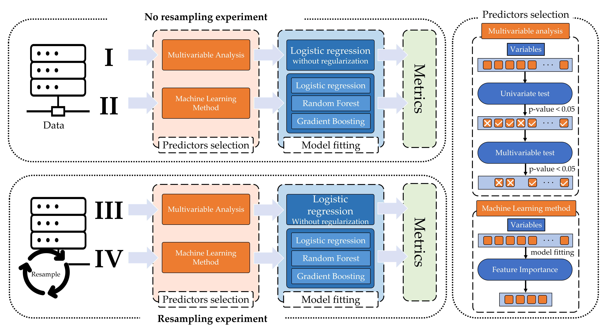

## Predictive power for thrombus detection after atrial appendage closure: machine learning vs. classical methods

### ABSTRACT

[link to DOI]
 
### Notebooks

- [Final experiments](https://github.com/IA-Cardiologia-husa/LAAC_Thrombus_detection_MLvsClassical/blob/main/Final_experiments.ipynb)
- [Additional experiments](https://github.com/IA-Cardiologia-husa/LAAC_Thrombus_detection_MLvsClassical/blob/main/Additional_experiments.ipynb)

---
# Requirements

Programming language: [Python 3](https://www.python.org/).

Dependencies:
- numpy
- pandas
- scikit-learn
- scipy
- plotnine
- warnings

A suitable [conda](https://docs.conda.io/projects/conda/en/latest/index.html) environment named LAAC_Thrombus_detection can be created and activated with:

    conda env create -f environment.yml
    conda activate LAAC_Thrombus_detection

otherwise

    pip install numpy pandas scipy scikit-learn plotnine warnings

---

## [FinalExperiments](https://github.com/IA-Cardiologia-husa/LAAC_Thrombus_detection_MLvsClassical/blob/main/Final_experiments.ipynb)

## [Additional experiments](https://github.com/IA-Cardiologia-husa/LAAC_Thrombus_detection_MLvsClassical/blob/main/Additional_experiments.ipynb)

